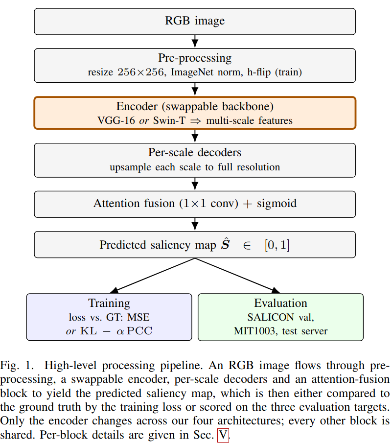
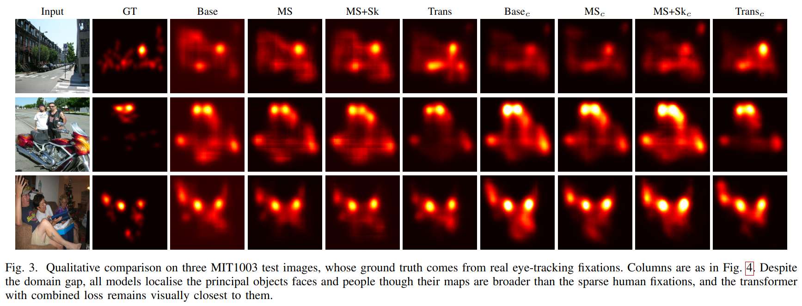

# Isolating the Encoder: A Controlled Comparison of CNNs and Vision Transformers for Saliency Prediction

[](https://pytorch.org/)

**Authors:** Gianluca Caregnato, Francesco Roncolato, Giuly Wang  
*Neural Networks and Deep Learning - University of Padova, Italy*

> **Resources:** [📄 Read the Report](https://drive.google.com/file/d/1XSRkrMrfw-ztZHfRSoIUiLX3DrM5lSZr/view?usp=drive_link) | [💾 Download Pre-trained Weights & Data](https://drive.google.com/drive/folders/1bVAjL3b8mk_b_BXVegb03yjuabg8PpmU?usp=sharing)

## Abstract
Visual saliency prediction requires models capable of simultaneously capturing fine localized details and global semantic context. In this project, we present a modular framework to systematically isolate and evaluate the contributions of different feature encoders, architectural components, and training objectives. We conduct a controlled comparison between standard Convolutional Neural Networks (VGG-16) and modern Vision Transformers (Swin-T) under an identical multi-scale decoding protocol. Furthermore, we analyze the impact of a combined Kullback-Leibler (KL) divergence and Pearson Correlation Coefficient (PCC) loss against a standard Mean Squared Error baseline. 

Evaluated on the [SALICON](https://www.kaggle.com/datasets/roshan401/salicon) and [MIT1003](https://people.csail.mit.edu/tjudd/WherePeopleLook/index.html) datasets, our findings demonstrate that substituting a CNN backbone with a Swin Transformer yields significant performance gains. Additionally, the combined loss improves correlation and distributional similarity across all tested architectures. Ultimately, our Swin Transformer model trained with the combined objective achieves the most robust generalization, highlighting the necessity of both self-attention mechanisms and distribution-aware losses in saliency prediction.

---

## 🏗️ Architecture & Pipeline


*High-level processing pipeline. The encoder is completely swappable, allowing for strict controlled comparisons across architectures.*

Our PyTorch implementation is highly modular. We isolate the encoder to compare four distinct configurations under an identical decoding and training protocol:
1. **Baseline VGG-16** (Encoder-Decoder)
2. **Multi-scale feature fusion**
3. **Skip connections** (U-Net style)
4. **Swin Transformer** (Swin-T)

## 📊 Key Results

We evaluated our models using standard metrics (PCC, NSS, AUC-Judd, JSS, and MSE) on the **SALICON** validation set and test set (the latter through the [SALICON challenge server](https://www.salicon.net/challenge)) and performed cross-dataset generalization testing on **MIT1003**. 

Our experiments show that the **Swin Transformer trained with our Combined Loss (KL - α*PCC)** outperforms the convolutional baselines significantly.

| Model | Loss | Params | CC ↑ | NSS ↑ | AUC-J ↑ | JSS ↑ | MSE ↓ |
| :--- | :---: | :---: | :---: | :---: | :---: | :---: | :---: |
| Baseline VGG-16 | MSE | 17.5M | 0.8605 | 0.5357 | 0.9256 | 0.8714 | 0.0105 |
| Baseline VGG-16 | Combined | 17.5M | 0.8756 | **0.5631** | 0.9499 | 0.9428 | 0.0114 |
| **Swin-T (Ours)** | **Combined** | **39.6M** | **0.9024** | 0.5500 | **0.9611** | **0.9566** | **0.0073** |

### Qualitative Comparison

*Qualitative comparison on SALICON validation images. The Swin Transformer with combined loss (Trans_c) yields the crispest, best-localized maps, most closely resembling human ground-truth fixations.*

---

## ⚙️ Project Structure
The codebase relies on a strict interface contract across the following modules:

* `config.py` - Centralized configurations for experiments.
* `data.py` - Dataset loaders, preprocessing, and augmentations (Outputs: `image [3,H,W]`, `gt [1,H,W]`).
* `models.py` - Model architectures utilizing a `@register_model` pattern.
* `losses.py` - Interchangeable and composable loss functions (MSE, KL, PCC).
* `metrics.py` - Evaluation metrics dict for the eval loop.
* `train.py` - Generic, config-driven training loop.
* `run.ipynb` - Main notebook for running experiments and generating report figures.

---

## 🚀 Installation & Setup

We recommend using `conda` for environment management:
```bash
conda env create -f environment.yml
conda activate nndl_saliency
python -m ipykernel install --user --name nndl_saliency --display-name "Python (NNDL Saliency)"
```

Alternatively, using `pip`:
```bash
pip install -r requirements.txt
```

## Usage

Running experiments is completely streamlined thanks to our configuration-driven pipeline:

1. **Configure:** Open `config.py` to define your experiment settings. This is where you specify the dataset, model architecture (from the registry), loss function, learning rate, and batch size.
2. **Run:** Open `run.ipynb`, ensure your kernel is set to **Python (NNDL Saliency)**, and run the cells. 

The notebook will automatically instantiate the chosen modules, execute the training loop, and generate the plots.
